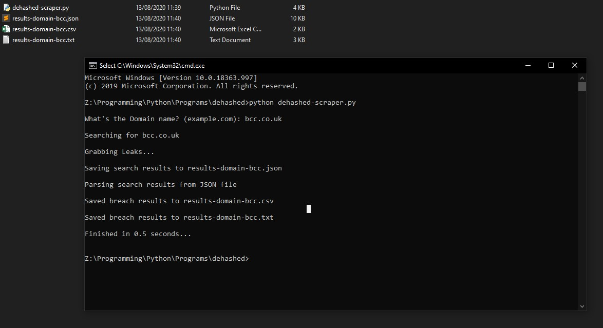

# Dehashed-Scraper
This is a tool I created to scrape breached info from the Dehashed site. 
You will need a <strong>API key</strong> and a <strong>valid subscription</strong> to use this tool, both you will have to enter before running. 
I have stated in the script where to put your information:
<pre><code>
class Dehashed_Scraper():
    # Authentication is email + API. BASIC Auth | Enter you Email and Dehashed API below
    <strong>dehashed_EMAIL = ''</strong>
    <strong>API_KEY = ''</strong>

    # Leave the below alone
    domain = ''
    headers = {'Accept': 'application/json'}
</code></pre>

## Download and run
Git cloning the repo
<pre><code>git clone https://github.com/Norseman2018/Dehashed-Scraper.git"</code></pre>
Run the script
<pre><code>python dehashed_scraper.py</code></pre>

